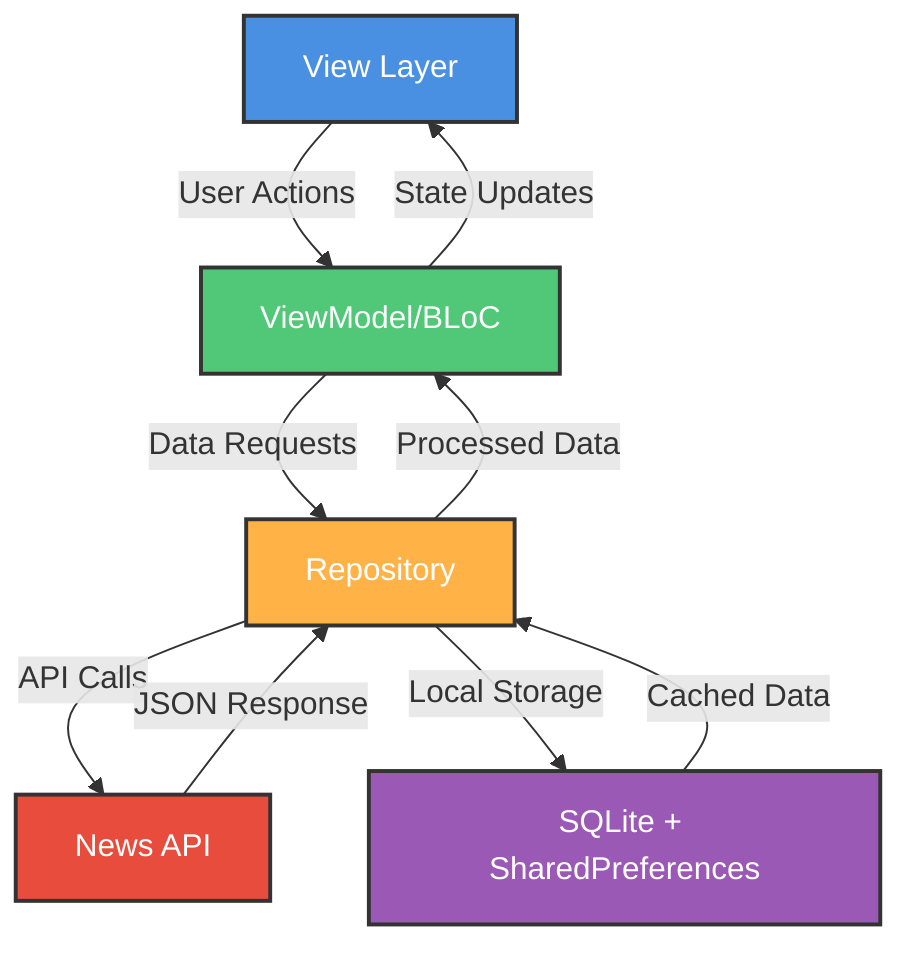

# TrueVerse 📰

<div align="center">


### Stay Informed, Stay True

A modern, feature-rich news application built with Flutter that delivers real-time news from around the world.

[](https://flutter.dev)
[](https://dart.dev)
[](https://github.com/SatishParmar1/TrueVerse--NewsApp/pulls)
[](https://github.com/SatishParmar1/TrueVerse--NewsApp/graphs/commit-activity)

[Features](#-features) • [Architecture](#-architecture) • [Getting Started](#-getting-started) • [Screenshots](#-screenshots) • [Contributing](#-contributing)

</div>

---

## ✨ Features

<table>
<tr>
<td>

- 📱 **Cross-Platform Support**
  - iOS & Android compatibility
  - Responsive design
  
- 🔐 **Social Authentication**
  - Google Sign-In
  - Facebook Login
  - Apple Sign-In
  
- 🗞️ **Real-Time News**
  - Powered by News API
  - Multiple categories
  - Search functionality

</td>
<td>

- 💾 **Smart Storage**
  - Offline reading with SQLite
  - SharedPreferences for settings
  - Efficient caching
  
- 🎨 **Beautiful UI**
  - Custom Google Fonts
  - SVG icon support
  - Smooth animations
  
- 📍 **Location-Based**
  - Local news
  - Geo-targeted content

</td>
</tr>
</table>

### Additional Features

🔄 **Share Articles** • 📅 **Date Filtering** • 🛡️ **Screen Protection** • 🔥 **Firebase Integration** • 📊 **Version Management** • 📸 **Image Support**

## 🏗️ Architecture

<div align="center">



**MVVM (Model-View-ViewModel) + BLoC Pattern**

</div>

### Project Structure

```
lib/
├── 📁 models/           # Data models and entities
├── 📁 views/            # UI screens and widgets
├── 📁 viewmodels/       # Business logic layer
├── 📁 blocs/            # BLoC state management
│   ├── events/          # BLoC events
│   ├── states/          # BLoC states
│   └── blocs/           # BLoC implementations
├── 📁 repositories/     # Data layer abstraction
├── 📁 services/         # API and local services
│   ├── api/             # News API service
│   ├── database/        # SQLite service
│   └── auth/            # Authentication services
├── 📁 utils/            # Helper functions and constants
└── 📁 widgets/          # Reusable UI components
```

## 📦 Tech Stack & Dependencies

<div align="center">

### Core Technologies


</div>

### 📚 Package Categories

<details>
<summary><b>State Management & Architecture</b></summary>

- `flutter_bloc: ^9.1.1` - BLoC pattern implementation
- `dio: ^5.9.0` - Powerful HTTP client

</details>

<details>
<summary><b>Local Storage</b></summary>

- `sqflite: ^2.4.2` - Local SQLite database
- `shared_preferences: ^2.5.3` - Key-value storage
- `path: ^1.9.1` - File path utilities

</details>

<details>
<summary><b>UI & Animations</b></summary>

- `shimmer_animation: ^2.2.2` - Loading placeholders
- `flutter_svg: ^2.2.0` - SVG rendering
- `google_fonts: ^6.2.1` - Custom typography
- `calendar_date_picker2: ^2.0.1` - Date selection
- `syncfusion_flutter_datepicker: ^31.1.19` - Advanced date picker

</details>

<details>
<summary><b>Firebase Services</b></summary>

- `firebase_remote_config: ^5.4.4` - Remote configuration
- `firebase_crashlytics: ^4.3.7` - Crash reporting

</details>

<details>
<summary><b>Features & Utilities</b></summary>

- `share_plus: ^11.0.0` - Share functionality
- `geolocator: ^14.0.2` - Location services
- `url_launcher: ^6.3.1` - Open external links
- `image_picker: ^1.1.2` - Image selection
- `screen_protector: ^1.4.2+1` - Screen security
- `package_info_plus: ^8.3.0` - App information
- `version: ^3.0.2` - Version management

</details>

## 🚀 Getting Started

### Prerequisites


### Installation Steps

1️⃣ **Clone the repository**
```bash
git clone [https://github.com/SatishParmar1/TrueVerse--NewsApp.git]
cd trueverse
```

2️⃣ **Install dependencies**
```bash
flutter pub get
```

3️⃣ **Configure API keys**

Create a `.env` file in the root directory:
```env
NEWS_API_KEY=your_news_api_key_here
```

4️⃣ **Set up Firebase**
- Download `google-services.json` for Android
- Download `GoogleService-Info.plist` for iOS
- Place them in respective directories
- Follow [Firebase setup guide](https://firebase.google.com/docs/flutter/setup)

5️⃣ **Run the app**
```bash
flutter run
```

## 🔧 Configuration

### 🗞️ News API Setup

1. Visit [newsapi.org](https://newsapi.org)
2. Sign up for a free account
3. Get your API key
4. Add it to your `.env` file

### 🔐 Social Authentication Setup

<table>
<tr>
<th>Provider</th>
<th>Setup Link</th>
<th>Required</th>
</tr>
<tr>
<td>
  
</td>
<td>
  <a href="https://console.cloud.google.com">Google Cloud Console</a>
</td>
<td>OAuth 2.0 Client ID</td>
</tr>
<tr>
<td>
  
</td>
<td>
  <a href="https://developers.facebook.com">Facebook Developers</a>
</td>
<td>App ID & Secret</td>
</tr>
<tr>
<td>
  
</td>
<td>
  <a href="https://developer.apple.com">Apple Developer</a>
</td>
<td>Service ID</td>
</tr>
</table>

## 📱 Screenshots

<div align="center">

### Coming Soon! 🎨

<table>
<tr>
<td align="center">

<br />
<b>Home Screen</b>
</td>
<td align="center">

<br />
<b>Article Detail</b>
</td>
<td align="center">

<br />
<b>Categories</b>
</td>
<td align="center">

<br />
<b>User Profile</b>
</td>
</tr>
</table>

</div>

## 🎯 Roadmap

<div align="center">

### Development Progress

</div>

- [x] 🏗️ MVVM architecture with BLoC
- [x] 📰 News API integration
- [x] 💾 Local storage (SQLite + SharedPreferences)
- [x] 🎨 UI components and animations
- [x] 📍 Location-based services
- [x] 🔥 Firebase integration
- [ ] 🔐 Google Authentication
- [ ] 📘 Facebook Authentication
- [ ] 🍎 Apple Authentication
- [ ] 🌙 Dark mode support
- [ ] 🔖 Bookmark functionality
- [ ] 🔔 Push notifications
- [ ] 🌍 Multi-language support
- [ ] 📊 Analytics dashboard
- [ ] 🎙️ Audio news feature

## 🤝 Contributing

<div align="center">

**Contributions are what make the open source community amazing!** 

[](https://github.com/SatishParmar1/TrueVerse--NewsApp/graphs/contributors)
[](https://github.com/SatishParmar1/TrueVerse--NewsApp/network/members)
[](https://github.com/SatishParmar1/TrueVerse--NewsApp/stargazers)
[](https://github.com/SatishParmar1/TrueVerse--NewsApp/issues)

</div>

### How to Contribute

1. 🍴 Fork the Project
2. 🔨 Create your Feature Branch (`git checkout -b feature/AmazingFeature`)
3. ✅ Commit your Changes (`git commit -m 'Add some AmazingFeature'`)
4. 📤 Push to the Branch (`git push origin feature/AmazingFeature`)
5. 🎉 Open a Pull Request

### Code Style

- Follow [Effective Dart](https://dart.dev/guides/language/effective-dart) guidelines
- Write meaningful commit messages
- Add comments for complex logic
- Write tests for new features


## 👨‍💻 Author

<div align="center">

**Your Name**

[](https://github.com/SatishParmar1)
[](https://linkedin.com/in/satish-parmar-ak978312)
[](mailto:satishparmarparmar486@gmail.com)

</div>

## 🙏 Acknowledgments

<div align="center">

Special thanks to:

- [News API](https://newsapi.org) for providing free news data
- [Flutter Team](https://flutter.dev) for the amazing framework
- [BLoC Library](https://bloclibrary.dev/) for state management
- All the open-source contributors
- The amazing Flutter community

</div>

---

<div align="center">

### 📊 Project Stats


**Made with ❤️ using Flutter**

⭐ **Star this repo if you find it useful!** ⭐


**Status**: 🔄 Actively Maintained & Continuously Updated

</div>


